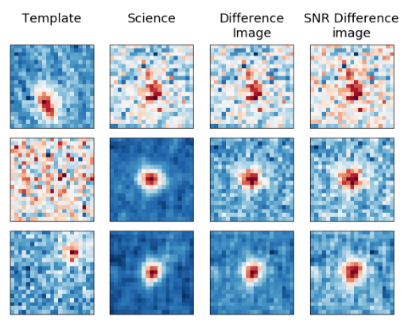
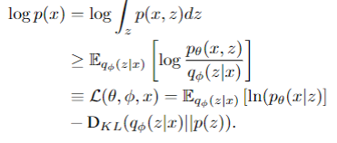
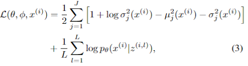
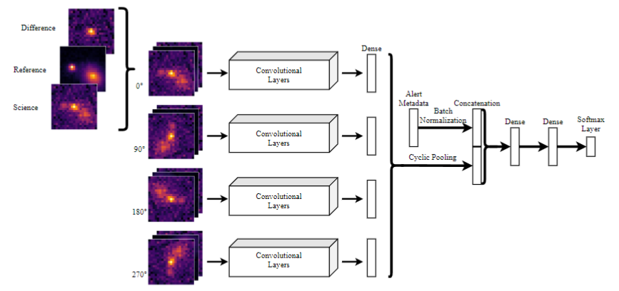

# Representación temporal de alertas ZTF
## P: alto, Tutor: Sebastián Guzmán
# Profesor: Pablito Estévez
ALeRCE es un broker de alertas astronómicas que recibe y procesa observaciones provenientes del survey ZTF en tiempo real. Dentro de los datos entregados por las alertas se encuentran los stamps o imágenes del lugar donde se produce la alerta. Estos stamps están compuestos por 3 imágenes: La imagen de referencia, la cual corresponde a un promedio de la posición antes de la alerta, imagen de ciencia correspondiente a una foto en el momento en que se detecta la alerta y la imagen de diferencia, siendo una diferencia entre las dos anteriores. Un objeto puede ser detectado más de una vez, lo cual agrega un carácter temporal a las alertas. El objetivo del proyecto es utilizar un AutoEncoder compuesto por una parte convolucional que procesa las imágenes y una parte recurrente que pueda procesar las características recurrentes entregadas por ZTF. Como mínimo se espera que implementen un AutoEncoder convolucional de la primera alerta basándose en el modelo entregado en referencias [1] y exploren la representación generada en el espacio latente. La base de datos requiere ser preprocesada antes de poder ser utilizada y se espera que realicen aumentaciones similares a las del modelo de referencia [2] y las del modelo mejorado [5].

Una vez generado el modelo para la primera alerta, se espera que puedan utilizar la representación para clasificar, donde se espera agreguen features para mejorar la clasificación, comparando resultados con lo obtenido en referencias [2]. Finalmente, se espera que puedan incluir capas recurrentes al modelo para procesar el carácter temporal de las muestras y comparar resultados de representación y clasificación con referencias [2].

## Referencias
- [1] Astorga, N., Huijse, P., Estévez, P. A., Forster, F. (2018, July). Clustering of Astronomical Transient Candidates Using Deep Variational Embedding. In 2018 International Joint Conference on Neural Networks (IJCNN). IEEE.
- [2] Carrasco-Davis, Rodrigo, et al. "Alert Classification for the ALeRCE Broker System: The Real-time Stamp Classifier." arXiv preprint arXiv:2008.03309 (2020).
- [3] Detector de supernovas - Cabrera-Vives, G., Reyes, I., Förster, F., Estévez, P. A., & Maureira, J. C. (2017). Deep-hits: Rotation invariant convolutional neural network for transient detection. The Astrophysical Journal, 836(1), 97.
- [4] Carrasco-Davis, Rodrigo, et al. “Deep Learning for Image Sequence Classification of Astronomical Events”. arXiv preprint arXiv:1807.03869 (2018)
- [5] Neira, D., Estévez, P. A., Forster, F. Temporal Stamp Classifier: Classifying Short Sequences of Astronomical Alerts (2024)
- [7] A. Krizhevsky, I. Sutskever, and G. E. Hinton, “Imagenet classification
with deep convolutional neural networks,” in Proceedings of the 25th
International Conference on Neural Information Processing Systems -
Volume 1, ser. NIPS’12. USA: Curran Associates Inc., 2012, pp. 1097–
1105

# Meeting 1

## Base de Datos
- Base de datos calibrada 50-50
- Factores de flasos
    - error CCDs 
    - Badly aligned substraction
    - cosmic rays
    - bg noise
    - other
- 1.250.000 test
- 100.000 validation
- 100.000 test
    

## Data Reduction
- se igualan templates y ciencia en base la PSF y se normaliza en base a una imgaen de SNR.

## Variotional AutoEncoder (VAE)
 - Combina CNN no supervisada + modelo generativo
 - VADE 
 - CNN [7] para extraer caracteristicas

### Estructura
#### Encoder
- NN with parameters $\phi$ encodes $X$ to $z$. 
- $z$ can be continous or discrete

#### Decoder
- NN with parameters $\theta$
- $z \rightarrow \hat{X}$

#### Loss Function
- Evidence Lower Bound (ELBO)

## Aumentacion

(GPT)

When someone asks to perform augmentations similar to those in the paper by Carrasco-Davis et al. (2020), they are likely referring to the data augmentation techniques used in training the convolutional neural network (CNN) for classifying astronomical alerts. Here’s what you would be expected to do:

1. Image Augmentation (IMPORTANT):

    Rotation: The paper mentions the use of rotational invariance. This means you would need to augment the training images by rotating them (e.g., 90°, 180°, and 270°) to make the model robust to different orientations of the astronomical objects.
    Zero Padding: The input images are padded to maintain the same dimensions after augmentation.

2. Normalization (IMPORTANT):

    Each image is normalized independently by subtracting the minimum pixel value and dividing by the maximum pixel value. This ensures that the pixel values are scaled between 0 and 1.

3. Metadata Integration:

    The augmentation process in this paper also involves combining image data with metadata (e.g., positional information, object brightness, etc.). You would need to normalize the metadata features as well and possibly perform some form of feature engineering to enhance their usefulness in the model.

4. Handling Missing Data (IMPORTANT):

    For any missing or corrupted data (e.g., NaN values due to pixel saturation), replace these with a default value (e.g., zero) as part of the preprocessing.

5. Entropy Regularization:

    To avoid overconfident predictions by the model, the paper implements an entropy regularization term in the loss function during training. This encourages the model to produce softer probability distributions rather than making overly confident predictions. You would be expected to apply a similar technique if your goal is to replicate the paper’s methodology closely.

6. Testing Different Combinations of Data:

    The paper discusses testing the classifier with different combinations of the available images (science, reference, and difference images) to evaluate their individual and combined contributions to classification accuracy. You would need to perform similar tests to understand the impact of different data combinations on your model’s performance.
    
    
In summary, the augmentation process would involve rotating images, normalizing them, integrating metadata, handling missing data carefully, applying entropy regularization, and possibly testing different combinations of input data to optimize the model's performance.

## Astronomia
- Core-collapse supernovae (SNe)
    - High energy explosion in collpase
    - High increase with low decrease in luminosity
